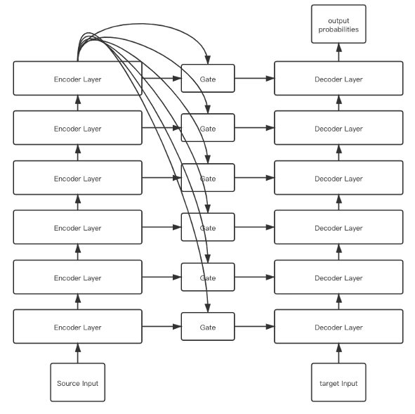
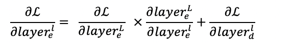
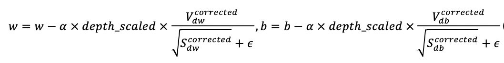
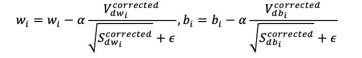
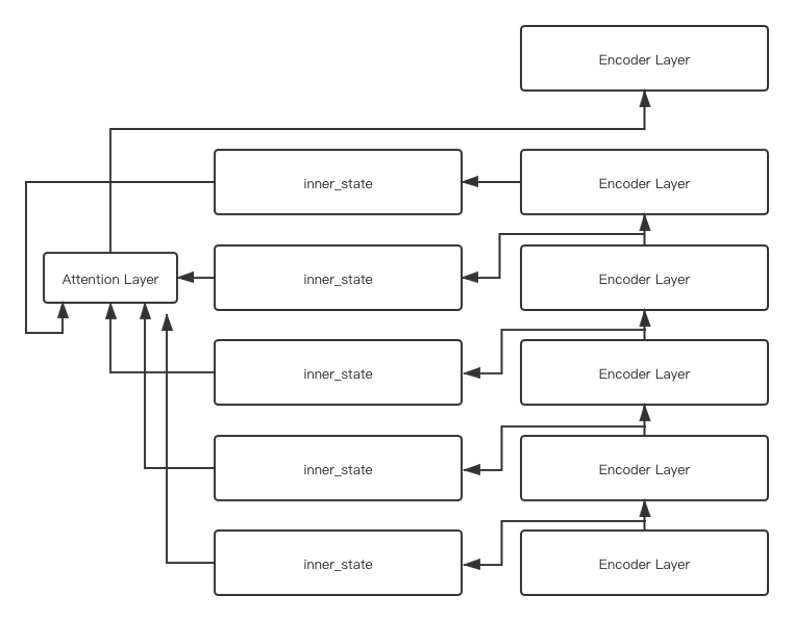
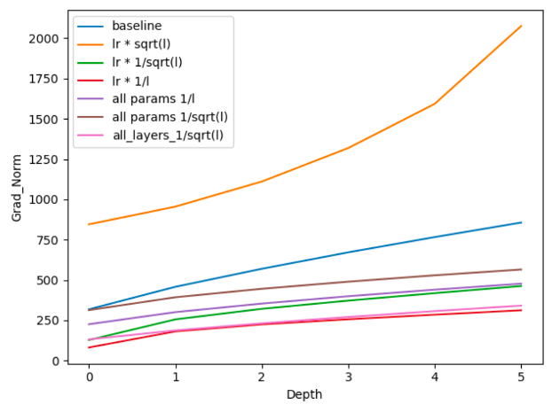

 # 神经机器翻译多尺度特征融合及分层优化方法研究
本项目主要对一下三个模型进行了实验：
- 基于门控的encoder-decoder间信息融合
- encoder层内基于attention机制的信息融合
- layer-wise Adam优化器。
# Dependencies
- fairseq version = 0.6.2
- PyTorch version >= 1.5.0
- Python version >= 3.6
- For training new models, you'll also need an NVIDIA GPU
# Dataset
使用iwslt17-de-en数据集

可通过以下命令获取：  
```py 
# 项目根路径下
cd examples/translation
bash prepare-iwslt14.sh
```
# preprocess
数据集预处理可通过以下命令实现：
```py 
# 项目根路径下
bash preprocess.sh
```
# training
```sh
bash train.sh
```
注：
- 基于门控的encoder-decoder间信息融合：arch = conn_en_de_transformer_t2t_iwslt_de_en
- encoder层内基于attention机制的信息融合: arch = layer_attention_transformer_t2t_iwslt_de_en
- layer-wise Adam优化器: 将train.py更换为j_train.py


# 模型结构
## 1、基于门控的encoder-decoder间信息融合
  
其中gate为共享权重的门控单元

- 模型梯度反向传播变为：
 

## 2、layer-wise Adam优化器
- 更新策略一：
 
其中depth_scaled为与当前层数相关的0到1之间的因子。
- 更新策略二：
 
其中i表示针对第i层参数的Adam优化器

## 3、encoder层内基于attention机制的特征融合
 

# 实验结果
## 基于门控的encoder-decoder间信息融合 & encoder层内基于attention机制的信息融合
# | Model |  De -> En |
--|--|--
1|Baseline|35.81
2|Gate_encoder_decoder|36.75
3|layer attention|33.81

注：baseline为transformer_t2t_iwslt_de_en
## layer-wise Adam优化器
#| 更新策略 |  意义 | 是否收敛 | 各层梯度方差变化情况 |bleu
--|--|--|--|--|--
1|lr|每一层更新步长为相同学习率|是|1612->39742|35.40
2|lr * (1/sqrt(l))|学习率随层数的增加而缩小|是|1579 -> 14728|30.83
3|lr * (1/l)|学习率随层数的增加而缩小|是|1579->6951|29.70
4|lr * (srqt(l))|学习率随层数的增加而增大|否|1579->209291|35.40
5|lr_i|每一层使用单独的Adam优化器进行优化|是||35.04

- 各种修改版策略各层梯度范数变化
 

# 总结
所有模型都未能实现性能的增长，这可能来自于模型细节的修改、超参数的设置、正则化方式、模型本身的错误等多种因素，本研究的意义在于，通过此次试验构建了完整的翻译系统，并得出了一些有价值的实验现象，为日后的科研工作打下了基础。
